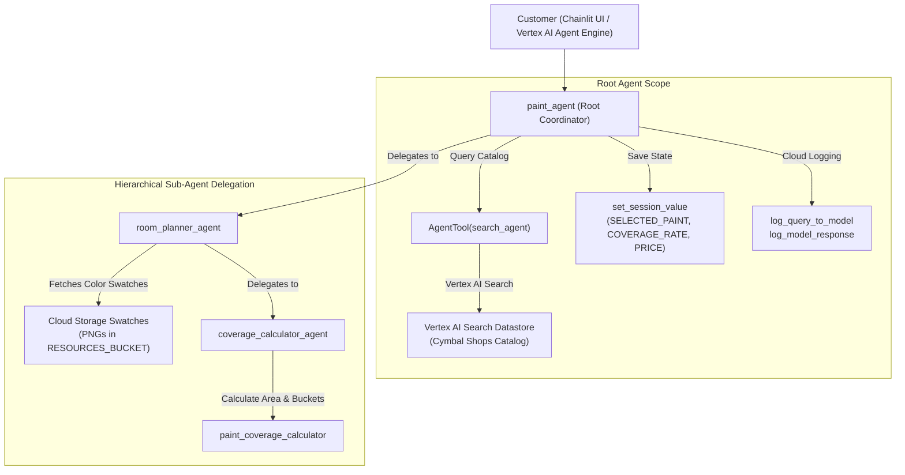

# Cymbal Shops Paint Department AI Assistant (Google ADK & Vertex AI Agent Engine)

[](https://www.python.org/downloads/)
[](https://google.github.io/adk-docs/)
[](https://cloud.google.com/vertex-ai)
[](https://partner.skills.google/focuses/130021?parent=catalog)
[](https://chainlit.io)

> **Lab Guide:** [Deploy an Agent with Agent Development Kit (ADK) (Focus 130021 / GENAI129)](https://partner.skills.google/focuses/130021?parent=catalog)  
> **Course Catalog:** Google Cloud Partner Skills / Google Cloud Skills Boost  
> **Architecture Pattern:** Hierarchical Multi-Agent Coordination, Tool Wrapping (`AgentTool`), Session State Injection (`{KEY?}`), Cloud Logging Callbacks, Vertex AI Agent Engines Deployment.

---

## 🏛️ Architecture Overview

The **Cymbal Shops Paint Department AI Assistant** is a hierarchical multi-agent system designed to guide customers through end-to-end paint selection, room planning, and paint coverage estimation.



---

## 📁 Repository Structure

```
.
├── .gitignore                                      # Comprehensive ignore rules
├── README.md                                       # Project documentation
├── takeaway-genai129-deploy-adk-agent-vertexai.md   # System Architecture & Engineering Guide
└── adk_challenge_lab/
    ├── .env.example                                # Environment variable template
    ├── requirements.txt                            # Python dependencies
    ├── test_adk.py                                 # Local ADK verification script
    ├── paint_agent/                                # ADK Hierarchical Agent Package
    │   ├── __init__.py
    │   ├── .env.example
    │   ├── agent.py                                # Root paint_agent definition
    │   ├── callback_logging.py                     # Cloud Logging integration hooks
    │   ├── tools.py                                # Session state tools
    │   └── sub_agents/
    │       ├── __init__.py
    │       ├── search_agent/                       # Product catalog search agent
    │       │   ├── __init__.py
    │       │   └── agent.py
    │       └── room_planner/                       # Room planning & color swatch agent
    │           ├── __init__.py
    │           ├── agent.py
    │           └── sub_agents/
    │               └── coverage_calculator/        # Volume & pricing calculation agent
    │                   ├── __init__.py
    │                   ├── agent.py
    │                   └── tools.py
    └── chainlit_ui/                                # Chainlit Web Interface
        ├── app.py                                  # Chainlit UI application
        ├── chainlit.md                             # UI introduction markdown
        ├── .chainlit/                              # Chainlit config & translations
        └── public/                                 # Logos, icons, and theme assets
```

---

## ⚙️ Environment Configuration

Copy `.env.example` to `.env` in `adk_challenge_lab/` and `adk_challenge_lab/paint_agent/`:

```bash
cp adk_challenge_lab/.env.example adk_challenge_lab/.env
cp adk_challenge_lab/.env.example adk_challenge_lab/paint_agent/.env
```

Configure the following variables:
* `GOOGLE_GENAI_USE_VERTEXAI`: Set to `TRUE` to use Vertex AI endpoints.
* `GOOGLE_CLOUD_PROJECT`: Your Google Cloud Project ID.
* `GOOGLE_CLOUD_LOCATION`: Google Cloud region (e.g. `us-central1`).
* `RESOURCES_BUCKET`: GCS bucket hosting the paint swatch images.
* `MODEL`: Gemini model version (e.g. `gemini-2.5-flash`).
* `SEARCH_ENGINE_ID`: Vertex AI Search engine ID for the paint catalog.

---

## 🚀 Getting Started

### 1. Install Dependencies
```bash
python -m venv .venv
source .venv/bin/activate
pip install -r adk_challenge_lab/requirements.txt
```

### 2. Test Local ADK Agent
```bash
python adk_challenge_lab/test_adk.py
```

### 3. Run the Chainlit Web UI
```bash
chainlit run adk_challenge_lab/chainlit_ui/app.py -w
```
