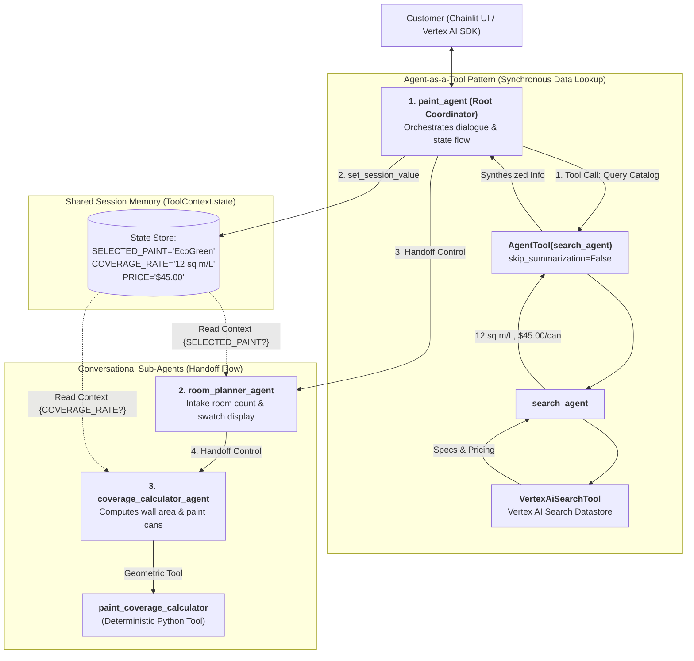

# Comprehensive Step-by-Step Instruction Guide: Deploy an Agent with Agent Development Kit (ADK) on Vertex AI

> **Lab Reference:** `GENAI129` | **Challenge Lab Track:** Deploy an Agent with Agent Development Kit (ADK)  
> **Business Scenario:** Cymbal Shops Paint Department AI Assistant  
> **Repository:** [`lab-genai129-deploy-an-Agent-with-Agent-Development-Kit`](https://github.com/junyish/lab-genai129-deploy-an-Agent-with-Agent-Development-Kit)  
> **Target Framework:** Google ADK (`google-adk`), Vertex AI Search / Discovery Engine, Vertex AI Reasoning Engine / Agent Runtime, Chainlit Streaming UI.

---

## 🎯 Architectural Overview & Multi-Agent Topology



---

## ⚡ The Core Dilemma: `search_agent` as Sub-Agent vs. Tool

One of the most frequent points of failure in **GENAI129** is misunderstanding the architectural difference between **Conversational Delegation (`sub_agents`)** and **Functional Tool Execution (`AgentTool`)**.

### ❌ The Flawed Anti-Pattern: Putting `search_agent` in `sub_agents`

```python
# ❌ INCORRECT / BROKEN PATTERN
root_agent = Agent(
    name="paint_agent",
    sub_agents=[search_agent, room_planner_agent],  # <-- ERROR!
    tools=[set_session_value],
)
```

#### Why This Breaks:
1. **Conversational Takeover:** In Google ADK, any agent listed in `sub_agents` is treated as an **interactive conversation handoff destination**. When the user asks, *"What paints do you offer?"*, `paint_agent` delegates control completely to `search_agent`.
2. **Loss of Control & State Blindness:** `search_agent` only has `VertexAiSearchTool`. It does **NOT** have `set_session_value` or a reference to `room_planner_agent`.
3. **Dead End in State Machine:** Once `search_agent` finishes answering the user's question, it cannot transition the user to the room planner or store the chosen paint. The conversational pipeline becomes stuck.

---

### ✅ The Solution: Wrapping `search_agent` as an `AgentTool`

```python
# ✅ CORRECT PRODUCTION PATTERN
from google.adk.tools import AgentTool
from .sub_agents.search_agent.agent import search_agent
from .sub_agents.room_planner.agent import room_planner_agent
from .tools import set_session_value

root_agent = Agent(
    name="paint_agent",
    model=Gemini(model=os.getenv("MODEL"), retry_options=RETRY_OPTIONS),
    instruction="""
    You represent the paint department of Cymbal Shops.

    Information about Cymbal Shops paint, including prices, is available to you
    through the 'search_agent' tool.

    - At the start of a conversation, let the user know you're here to
      help them find the right paint for their project. Ask them if they'd
      like to learn more about the different paint products offered by
      Cymbal Shops.
    - If they say yes, include information about all paint products including
      coverage rate and price.
    - If price and coverage rate aren't returned for some products, look them
      up individually.
    - After they have selected a paint product, use your set_session_value tool
      to store their selection in the session dictionary with the key
      'SELECTED_PAINT', its coverage rate in 'COVERAGE_RATE', and its price
      per 2.5L container in 'PRICE'.
    - Transfer to the 'room_planner_agent'
    """,
    sub_agents=[room_planner_agent],  # Only room_planner is a conversational sub-agent
    tools=[
        AgentTool(agent=search_agent, skip_summarization=False),  # search_agent is a TOOL
        set_session_value,
    ],
)
```

### 📊 Comparative Matrix: `sub_agents` vs. `AgentTool`

| Dimension | `sub_agents=[agent]` (Handoff) | `AgentTool(agent=agent)` (Tool Call) |
| :--- | :--- | :--- |
| **Execution Model** | **Asynchronous Handoff:** Control is transferred to child agent. | **Synchronous Query:** Parent calls child in the background and gets return text. |
| **User Interaction** | User directly talks with the child agent persona. | User continues talking to parent agent; parent summarizes child's output. |
| **State Retention** | Child must manage its own transitions or bubble back up. | Parent maintains uninterrupted session state and workflow ownership. |
| **Role in Lab** | Used for `room_planner_agent` & `coverage_calculator_agent`. | Used exclusively for `search_agent` (paint product catalog retrieval). |

---

## 📋 Task-by-Task Step-by-Step Lab Walkthrough

---

### 📋 Task 1: Set Up the Environment & Configure Project Variables

1. Open Google Cloud Shell and export your active environment variables:

```bash
# Export active project and region
export GOOGLE_CLOUD_PROJECT=$(gcloud config get-value project 2>/dev/null)
export GOOGLE_CLOUD_LOCATION="us-central1"
export MODEL="gemini-2.5-flash"
export GOOGLE_GENAI_USE_VERTEXAI="true"

# Verify variables
echo "=========================================================="
echo "Project:  ${GOOGLE_CLOUD_PROJECT}"
echo "Location: ${GOOGLE_CLOUD_LOCATION}"
echo "Model:    ${MODEL}"
echo "=========================================================="
```

2. Enable the foundational Google Cloud service APIs:

```bash
gcloud services enable \
    aiplatform.googleapis.com \
    discoveryengine.googleapis.com \
    storage.googleapis.com \
    logging.googleapis.com \
    --project "${GOOGLE_CLOUD_PROJECT}"
```

3. Initialize the Python virtual environment and install ADK dependencies:

```bash
# Clone the repository
git clone https://github.com/junyish/lab-genai129-deploy-an-Agent-with-Agent-Development-Kit.git
cd lab-genai129-deploy-an-Agent-with-Agent-Development-Kit/adk_challenge_lab

# Create and activate virtual environment
python3 -m venv .venv
source .venv/bin/activate

# Install dependencies (including google-adk)
pip install -r requirements.txt
```

---

### 📋 Task 2: Configure the Search Agent & Vertex AI Search Datastore

The lab environment automatically provisions a **Vertex AI Search Engine** containing Cymbal Shops paint catalog documents.

1. Fetch your search engine ID using `gcloud`:

```bash
# Locate your provisioned Search Engine ID
gcloud alpha discovery-engine engines list \
    --location="global" \
    --collection="default_collection" \
    --project="${GOOGLE_CLOUD_PROJECT}"
```

*(Alternatively, navigate to **Vertex AI Search and Conversation** in the Google Cloud Console and copy the Engine ID).*

2. Create the `.env` file in `adk_challenge_lab/`:

```bash
cat << EOF > .env
GOOGLE_CLOUD_PROJECT=${GOOGLE_CLOUD_PROJECT}
GOOGLE_CLOUD_LOCATION=${GOOGLE_CLOUD_LOCATION}
MODEL=${MODEL}
SEARCH_ENGINE_ID=your_search_engine_id_here
GOOGLE_GENAI_USE_VERTEXAI=true
EOF
```

3. Open `paint_agent/sub_agents/search_agent/agent.py` and verify/complete the search agent implementation:

```python
# paint_agent/sub_agents/search_agent/agent.py
import os
from dotenv import load_dotenv

from google.adk.agents import Agent
from google.adk.models import Gemini
from google.adk.tools import VertexAiSearchTool
from google.genai import types

load_dotenv()

RETRY_OPTIONS = types.HttpRetryOptions(initial_delay=1, max_delay=3, attempts=30)

SEARCH_ENGINE_PATH = (
    f"projects/{os.getenv('GOOGLE_CLOUD_PROJECT')}/"
    f"locations/global/collections/default_collection/"
    f"engines/{os.getenv('SEARCH_ENGINE_ID')}"
)

paint_search_tool = VertexAiSearchTool(search_engine_id=SEARCH_ENGINE_PATH)

search_agent = Agent(
    name="search_agent",
    model=Gemini(model=os.getenv("MODEL"), retry_options=RETRY_OPTIONS),
    instruction="""
    If the user asked for specific paints, look up information on requested paints.
    Otherwise, provide the user information about all Cymbal Shops paints, including price
    and coverage rate.
    """,
    tools=[paint_search_tool],
)
```

---

### 📋 Task 3: Configure `paint_agent` (Root Coordinator) & Session State

In this task, we apply the crucial architectural fix: wrapping `search_agent` as an `AgentTool`, implementing `set_session_value`, and setting `sub_agents=[room_planner_agent]`.

1. **Implement Session State Tool (`paint_agent/tools.py`):**

```python
# paint_agent/tools.py
from google.adk.tools import ToolContext

def set_session_value(key: str, value: str, tool_context: ToolContext) -> str:
    """Stores a key-value pair in the shared session state dictionary."""
    tool_context.state[key] = value
    return f"Successfully saved session state: {key} = {value}"
```

2. **Configure Root `paint_agent` (`paint_agent/agent.py`):**

```python
# paint_agent/agent.py
import os
from dotenv import load_dotenv
import google.cloud.logging

from google.adk.agents import Agent
from google.adk.tools import AgentTool
from google.adk.models import Gemini
from google.genai import types

from .callback_logging import log_query_to_model, log_model_response
from .sub_agents.room_planner.agent import room_planner_agent
from .sub_agents.search_agent.agent import search_agent
from .tools import set_session_value

load_dotenv()

RETRY_OPTIONS = types.HttpRetryOptions(initial_delay=1, max_delay=3, attempts=30)

# Configure logging
cloud_logging_client = google.cloud.logging.Client()
cloud_logging_client.setup_logging()

root_agent = Agent(
    name="paint_agent",
    model=Gemini(model=os.getenv("MODEL"), retry_options=RETRY_OPTIONS),
    instruction="""
    You represent the paint department of Cymbal Shops.

    Information about Cymbal Shops paint, including prices, is available to you
    through the 'search_agent' tool.

    - At the start of a conversation, let the user know you're here to
      help them find the right paint for their project. Ask them if they'd
      like to learn more about the different paint products offered by
      Cymbal Shops.
    - If they say yes, include information about all paint products including
      coverage rate and price.
    - If price and coverage rate aren't returned for some products, look them
      up individually.
    - After they have selected a paint product, use your set_session_value tool
      to store their selection in the session dictionary with the key
      'SELECTED_PAINT', its coverage rate in 'COVERAGE_RATE', and its price
      per 2.5L container in 'PRICE'.
    - Transfer to the 'room_planner_agent'
    """,
    before_model_callback=log_query_to_model,
    after_model_callback=log_model_response,
    sub_agents=[room_planner_agent],
    tools=[
        # search_agent is wrapped as a tool
        AgentTool(agent=search_agent, skip_summarization=False),
        set_session_value,
    ],
)
```

---

### 📋 Task 4: Implement `room_planner_agent` & `coverage_calculator_agent`

1. **Room Planner Agent (`paint_agent/sub_agents/room_planner/agent.py`):**

```python
# paint_agent/sub_agents/room_planner/agent.py
import os
from google.adk.agents import Agent
from google.adk.models import Gemini
from google.genai import types
from .sub_agents.coverage_calculator.agent import coverage_calculator_agent

RETRY_OPTIONS = types.HttpRetryOptions(initial_delay=1, max_delay=3, attempts=30)

room_planner_agent = Agent(
    name="room_planner_agent",
    model=Gemini(model=os.getenv("MODEL"), retry_options=RETRY_OPTIONS),
    instruction="""
    You help customers plan the rooms they wish to paint.
    - Ask the user how many rooms they would like to paint.
    - Based on the {SELECTED_PAINT?}, display the corresponding color swatch image:
      - EcoGreen: https://storage.googleapis.com/paint-assets/ecogreen.png
      - SkyBlue: https://storage.googleapis.com/paint-assets/skyblue.png
      - SunBurst: https://storage.googleapis.com/paint-assets/sunburst.png
    - Once the room details are gathered, transfer to 'coverage_calculator_agent'.
    """,
    sub_agents=[coverage_calculator_agent],
)
```

2. **Geometric Calculator Tool (`coverage_calculator/tools.py`):**

```python
# paint_agent/sub_agents/room_planner/sub_agents/coverage_calculator/tools.py
async def paint_coverage_calculator(
    length_m: float,
    width_m: float,
    height_m: float,
    doors: int = 0,
    windows: int = 0
) -> dict:
    """Calculates paint required for room walls excluding standard doors/windows."""
    DOOR_AREA = 1.95  # sq meters
    WINDOW_AREA = 1.50 # sq meters
    
    total_wall_area = 2 * (length_m + width_m) * height_m
    deductions = (doors * DOOR_AREA) + (windows * WINDOW_AREA)
    net_wall_area = max(0.0, total_wall_area - deductions)
    
    return {
        "net_wall_area_sq_m": round(net_wall_area, 2),
        "two_coats_area_sq_m": round(net_wall_area * 2, 2)
    }
```

3. **Coverage Calculator Agent (`coverage_calculator/agent.py`):**

```python
# paint_agent/sub_agents/room_planner/sub_agents/coverage_calculator/agent.py
import os
from google.adk.agents import Agent
from google.adk.models import Gemini
from google.genai import types
from .tools import paint_coverage_calculator

RETRY_OPTIONS = types.HttpRetryOptions(initial_delay=1, max_delay=3, attempts=30)

coverage_calculator_agent = Agent(
    name="coverage_calculator_agent",
    model=Gemini(model=os.getenv("MODEL"), retry_options=RETRY_OPTIONS),
    instruction="""
    The user has selected the paint: {SELECTED_PAINT?}.
    The coverage rate for this paint is: {COVERAGE_RATE?}.
    The price per 2.5L container is: {PRICE?}.

    - For each room, ask for length, width, height, and number of doors/windows.
    - Call 'paint_coverage_calculator' to compute required area.
    - Calculate total 2.5L cans required (assume 2 coats) and total price.
    """,
    tools=[paint_coverage_calculator],
)
```

---

### 📋 Task 5: Deploy the Agent to Vertex AI Agent Engine (`adk deploy agent_engine`)

In this task, we use the official **ADK CLI** deployment command `adk deploy agent_engine` to package, stage, and deploy the multi-agent system to **Vertex AI Agent Engine (Reasoning Engine)**.

1. Create a Google Cloud Storage bucket for staging deployment artifacts (if not already present):

```bash
gcloud storage buckets create gs://${GOOGLE_CLOUD_PROJECT}-bucket \
    --location=${GOOGLE_CLOUD_LOCATION} \
    --project=${GOOGLE_CLOUD_PROJECT}
```

2. Execute the `adk deploy agent_engine` command from the project root (`adk_challenge_lab/`):

```bash
adk deploy agent_engine \
    --project=${GOOGLE_CLOUD_PROJECT} \
    --region=${GOOGLE_CLOUD_LOCATION} \
    --staging_bucket=gs://${GOOGLE_CLOUD_PROJECT}-bucket \
    --display_name="cymbal-paint-assistant" \
    paint_agent
```

#### What `adk deploy agent_engine` Does Behind the Scenes:
1. **Packaging:** Discovers the `paint_agent` package, bundling root agent and all sub-agents (`search_agent`, `room_planner`, `coverage_calculator`).
2. **Staging:** Uploads tarball distribution artifacts to the specified GCS `staging_bucket`.
3. **Provisioning:** Calls `aiplatform.googleapis.com` to create a managed `ReasoningEngine` / `agent_engines` resource.
4. **Returns Resource Identifier:** Outputs the fully qualified agent resource name:
   ```text
   Agent Engine deployed successfully!
   Resource Name: projects/YOUR_PROJECT_NUMBER/locations/us-central1/reasoningEngines/YOUR_ENGINE_ID
   ```

---

### 📋 Task 6: Connect Chainlit Streaming UI & Verify Live Operation

1. Open `chainlit_ui/app.py` and update the reasoning engine resource path with the resource ID output in Task 5:

```python
# chainlit_ui/app.py
agent = client.agent_engines.get(
    name="projects/YOUR_PROJECT_NUMBER/locations/us-central1/reasoningEngines/YOUR_ENGINE_ID"
)
```

2. Launch the interactive Chainlit application:

```bash
cd chainlit_ui
chainlit run app.py -w --port 8080
```

3. Open the Web Preview on port `8080` in Cloud Shell.

4. **Execute Verification Dialogue:**
   - **User:** *"Tell me about Cymbal Shops' interior paints."*
     - **Agent:** Calls `search_agent` internally via `AgentTool`, lists EcoGreen ($45.00, 12 sq m/L), SkyBlue ($40.00, 10 sq m/L), and SunBurst ($42.00, 11 sq m/L).
   - **User:** *"I'd like to use EcoGreen."*
     - **Agent:** Stores `SELECTED_PAINT="EcoGreen"`, `COVERAGE_RATE="12 sq m/L"`, `PRICE="$45.00"` into `ToolContext.state`, renders the EcoGreen image swatch, and transfers to `room_planner_agent`.
   - **User:** *"I'm painting 1 room. Length is 5m, width is 4m, height is 2.7m, 1 door, 1 window."*
     - **Agent:** `coverage_calculator_agent` computes wall area using `paint_coverage_calculator`, calculates required coats & 2.5L cans, and outputs total estimated cost.

---

## 🏆 Summary Checklist for Passing Lab 129

| Item | Requirement | Verified? |
| :---: | :--- | :--- :|
| 1 | `search_agent` is wrapped in `AgentTool(search_agent)` inside `paint_agent.tools` | ✅ |
| 2 | `room_planner_agent` is the ONLY child in `paint_agent.sub_agents` | ✅ |
| 3 | `SELECTED_PAINT`, `COVERAGE_RATE`, and `PRICE` are written via `set_session_value` | ✅ |
| 4 | Color swatch URLs are rendered in Markdown/HTML by `room_planner_agent` | ✅ |
| 5 | Wall coverage and required 2.5L cans are calculated deterministically by `paint_coverage_calculator` | ✅ |
| 6 | Agent is deployed using `adk deploy agent_engine` | ✅ |
| 7 | End-to-end multi-turn conversation verified on Chainlit UI | ✅ |
