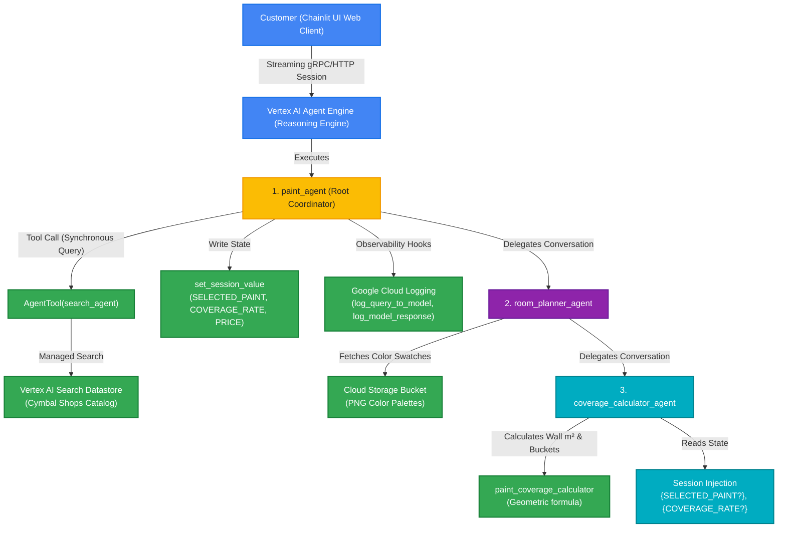
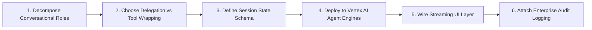

# Architecture & Engineering Guide: Deploying Hierarchical Multi-Agent Systems to Vertex AI Agent Engines

> **Lab Reference:** `GENAI129` — *Deploy an Agent with Agent Development Kit (ADK)*  
> **Architecture Pattern:** Hierarchical Multi-Agent Coordination, Tool Wrapping, State Injection, Cloud Logging  
> **Core Technologies:** Google Agent Development Kit (ADK), Vertex AI Reasoning Engine / Agent Engines, Gemini 2.5 Flash, Vertex AI Search, Google Cloud Logging, Chainlit Streaming UI.

---

## Executive Summary & System Architecture

Enterprises moving from simple RAG chatbots to multi-step transactional workflows require **hierarchical delegation**, **session state isolation**, and **managed cloud runtime deployment**. Monolithic prompt chains fail when tasks span heterogeneous competencies (e.g. searching a 10,000-item retail catalog vs. conducting geometric wall-surface mathematical calculations).

This lab implements a production **Hierarchical Multi-Agent Customer Assistant (Cymbal Shops Paint Department)** deployed to **Vertex AI Reasoning Engine / Agent Engines** and served to end-users via a real-time reactive **Chainlit UI**.



---

## 1. Core Architectural Pillars

### 1.1 Hierarchical Delegation (`sub_agents`) vs. Tool Wrapping (`AgentTool`)
A foundational architectural pattern in ADK is knowing when to **delegate conversation ownership** vs. when to **query an agent as a functional tool**:

| Dimension | `sub_agents=[agent_b]` (Delegation) | `AgentTool(agent=agent_b)` (Tool Wrapping) |
| :--- | :--- | :--- |
| **Control Flow** | Control is handed off to `agent_b`. `agent_b` directly interacts with the user. | Control remains with the parent agent. `agent_b` is queried in the background. |
| **User Visibility** | The user enters a new persona/specialist conversation context (e.g. `room_planner_agent`). | The user is unaware of the sub-agent; parent synthesizes the tool result. |
| **Ideal Use Case** | Multi-turn conversational phases (Room planning, checkout flow, incident triage). | Stateless or auxiliary data lookup (Search catalog, vector lookup, compliance check). |
| **Lab Example** | `paint_agent` delegates to `room_planner_agent`, which delegates to `coverage_calculator_agent`. | `paint_agent` queries `search_agent` via `AgentTool(agent=search_agent)` to inspect paint specs without losing conversational context. |

```python
# AgentTool wrapping: search_agent runs as a tool inside paint_agent
tools=[
    AgentTool(agent=search_agent, skip_summarization=False),
    set_session_value,
]

# sub_agents delegation: conversation hands off to room_planner_agent
sub_agents=[room_planner_agent]
```

### 1.2 Session State Management & Dynamic Context Injection
Multi-agent systems require sharing contextual variables across disconnected agents without polluting the LLM prompt with repetitive message history:
1. **Explicit Session State Writing:** The `set_session_value` tool writes structured key-value pairs directly to `ToolContext.state`:
   ```python
   def set_session_value(key: str, value: str, context: ToolContext) -> str:
       context.state[key] = value
       return f"stored '{value}' in '{key}'"
   ```
2. **Declarative Prompt Injection:** Downstream agents (`room_planner_agent`, `coverage_calculator_agent`) automatically read session state via `{KEY?}` optional variable syntax:
   ```python
   instruction="""
   The user has selected the paint: {SELECTED_PAINT?}.
   The coverage rate for this paint is: {COVERAGE_RATE?}.
   """
   ```

### 1.3 Enterprise Observability via Callback Hooks
Enterprise agents must log inputs, intermediate reasoning, tool calls, and model outputs to centralized monitoring systems (Google Cloud Logging) without cluttering agent business logic:
* **`before_model_callback`:** Intercepts outgoing requests to log exact prompt payloads.
* **`after_model_callback`:** Intercepts model responses to log text outputs and function calls.

```python
def log_query_to_model(callback_context: CallbackContext, llm_request: LlmRequest):
    if llm_request.contents and llm_request.contents[-1].role == "user":
        last_user_message = llm_request.contents[-1].parts[-1].text
        logging.info(f"[query to {callback_context.agent_name}]: {last_user_message}")

def log_model_response(callback_context: CallbackContext, llm_response: LlmResponse):
    if llm_response.content and llm_response.content.parts:
        for part in llm_response.content.parts:
            if part.text:
                logging.info(f"[response from {callback_context.agent_name}]: {part.text}")
            elif part.function_call:
                logging.info(f"[function call from {callback_context.agent_name}]: {part.function_call.name}")
```

---

## 2. GCP & Ecosystem Product Deep Dive

### 2.1 Google Agent Development Kit (ADK)
* **Agent Engine:** Provides hierarchical agent primitives (`Agent`), model abstractions (`Gemini`), and tool connectors (`AgentTool`, `VertexAiSearchTool`).
* **Session Persistence:** Manages multi-turn conversation memory and session state across distributed requests.
* **Exponential Backoff & Resilience:** Handles API rate limits gracefully via `types.HttpRetryOptions(initial_delay=1, max_delay=3, attempts=30)`.

### 2.2 Vertex AI Reasoning Engine / Agent Engines
* **Serverless Agent Runtime:** Vertex AI Agent Engines host and manage containerized agent logic with built-in auto-scaling, session management, and IAM security.
* **SDK Client Integration:**
  ```python
  import vertexai
  client = vertexai.Client(project=project_id, location=location)
  agent = client.agent_engines.get(name="projects/.../locations/.../reasoningEngines/...")
  
  # Session Creation
  session = agent.create_session(user_id="user_123")
  
  # Asynchronous Streaming
  async for event in agent.async_stream_query(session_id=session["id"], message="Hello"):
      yield event
  ```

### 2.3 Vertex AI Search (Enterprise Datastore)
* **Zero-ETL Search Grounding:** Fully managed semantic search over structured or unstructured product catalogs.
* **ADK Built-in Connector:** `VertexAiSearchTool(search_engine_id=...)` connects the search datastore directly into Gemini's tool-calling pipeline.

### 2.4 Real-time Reactive UI (Chainlit Integration)
* **Streaming Responses:** Consumes `agent.async_stream_query` and streams text tokens in real-time to the frontend.
* **Multi-Modal HTML Swatch Transformation:** Parses inline `` tags emitted by agents using BeautifulSoup and transforms them into native Chainlit visual elements (`cl.Image`).

---

## 3. Production Generalization Framework & Implementation Playbook



### Step 1: Decompose Conversational Roles
* Avoid creating "all-in-one" mega-agents. Break workflows into distinct personas:
  * **Intake & Discovery:** Understands user needs and queries catalogs (`paint_agent`).
  * **Domain Planning:** Collects room/project parameters and presents visual options (`room_planner_agent`).
  * **Mathematical/Transactional Execution:** Executes precise deterministic calculations (`coverage_calculator_agent`).

### Step 2: Choose Delegation (`sub_agents`) vs Tool Wrapping (`AgentTool`)
* Use `sub_agents` when the sub-agent needs to own subsequent turns with the user.
* Use `AgentTool` when the parent agent just needs quick information retrieval without losing user focus.

### Step 3: Define Session State Schema
* Use `ToolContext.state` to store global transaction variables (`SELECTED_PAINT`, `COVERAGE_RATE`, `PRICE`).
* Inject variables using `{VARIABLE?}` in prompt instructions so leaf agents inherit context seamlessly.

### Step 4: Deploy to Managed Vertex AI Agent Engines
* Package agent definitions with `google-cloud-aiplatform[agent_engines,adk]`.
* Register and deploy via Vertex AI Agent Engines / Reasoning Engine for managed autoscaling and enterprise IAM.

### Step 5: Wire Streaming UI Layer
* Use `agent.async_stream_query` for low time-to-first-token (TTFT).
* Post-process multi-modal elements (images, tables, markdown) in the UI bridge.

### Step 6: Attach Enterprise Audit Logging
* Wire Cloud Logging into `before_model_callback` and `after_model_callback`.
* Track latency, prompt inputs, model outputs, and tool execution logs in Cloud Logging for compliance and monitoring.

---

## 4. Key Takeaways Summary

1. **Hierarchy Prevents Prompt Bloat:** Dividing conversational responsibility across `sub_agents` and `AgentTool` prevents system prompts from becoming fragile and unwieldy.
2. **Session State Solves Data Handoffs:** Passing variables through `context.state` and `{VARIABLE?}` guarantees reliable cross-agent parameter sharing without hallucination.
3. **Managed Agent Engines Enable Enterprise Scalability:** Deploying to Vertex AI Agent Engines provides zero-infrastructure scaling, built-in session routing, and enterprise IAM governance.
4. **Multi-Modal Delivery with Streaming UI:** Blending text streaming with reactive multi-modal rendering (e.g. paint color swatches) delivers a polished consumer-ready experience.
