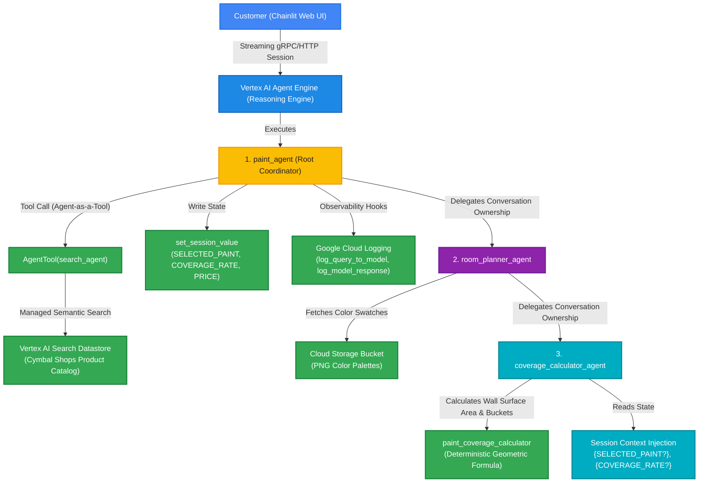
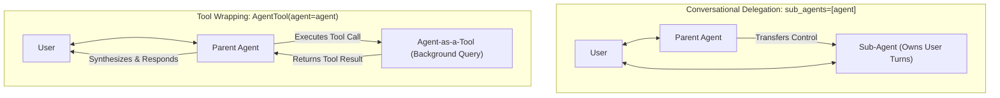
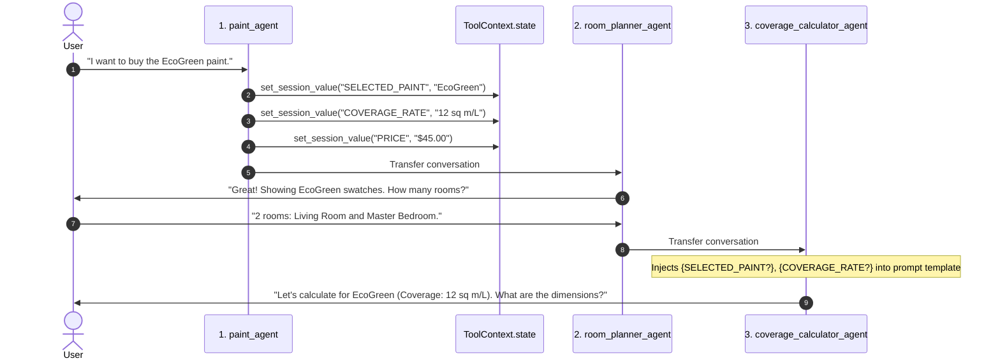
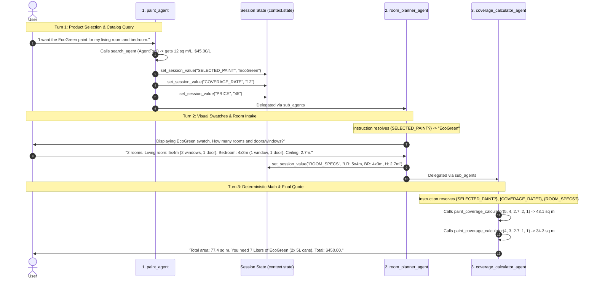
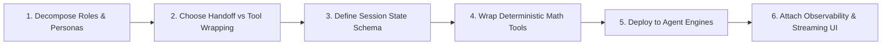

# Architecture & Engineering Guide: Deploying Hierarchical Multi-Agent Systems to Vertex AI Agent Engines

> **Lab Reference:** `GENAI129 / Focus 130021` — *Deploy an Agent with Agent Development Kit (ADK)*  
> **Curriculum Track:** Google Agent Development Kit (ADK) & Vertex AI Reasoning Engine / Agent Platform  
> **Architecture Pattern:** Hierarchical Multi-Agent Coordination, Tool Wrapping, State Injection, Cloud Logging, Streaming UI Bridge  
> **Core Technologies:** Google Agent Development Kit (ADK), Vertex AI Reasoning Engine / Agent Engines, Gemini 2.5 Flash, Vertex AI Search, Google Cloud Logging, Chainlit Streaming UI.

---

## Executive Summary & System Architecture

Modern enterprise AI applications require a fundamental transition from single-prompt RAG chatbots to **multi-agent hierarchical systems with deterministic compute tools and managed cloud runtimes**. In complex domains (such as retail commerce, insurance claims, or technical diagnostics), monolithic prompt chains suffer from context dilution, prompt bloat, hallucinated arithmetic, and lost state across multi-turn sessions.

This engineering guide details the design, implementation, and deployment of a production-grade **Hierarchical Multi-Agent Assistant (Cymbal Shops Paint Department)** deployed to **Vertex AI Reasoning Engine / Agent Engines** and connected to a reactive **Chainlit Streaming Web UI**.



---

## 1. Core Architectural Pillars

### 1.1 Hierarchical Delegation (`sub_agents`) vs. Tool Wrapping (`AgentTool`)

A core architectural decision in multi-agent engineering is choosing between **conversational handoff** and **functional tool invocation**:



| Dimension | `sub_agents=[sub_agent]` (Conversational Delegation) | `AgentTool(agent=sub_agent)` (Tool Wrapping) |
| :--- | :--- | :--- |
| **Control Flow** | Control is transferred downward to the child agent. Child agent directly conducts multi-turn conversation with the user. | Control stays with parent agent. Sub-agent is queried synchronously as a black-box tool. |
| **User Visibility** | User interacts with the sub-agent's persona (e.g. `room_planner_agent`). | User remains in conversation with parent agent; sub-agent output is synthesized by parent. |
| **Ideal Use Cases** | Multi-step interactive workflows (room dimension intake, checkout flows, technical debugging). | Single-shot retrieval, summarization, or domain-specific lookups (catalog search, policy lookup). |
| **Lab Implementation** | `paint_agent` $\rightarrow$ `room_planner_agent` $\rightarrow$ `coverage_calculator_agent`. | `paint_agent` queries `search_agent` via `AgentTool(agent=search_agent, skip_summarization=False)` to fetch paint specs. |

#### Implementation Pattern:
```python
# Root Agent Configuration (adk_challenge_lab/paint_agent/agent.py)
root_agent = Agent(
    name="paint_agent",
    model=Gemini(model=os.getenv("MODEL"), retry_options=RETRY_OPTIONS),
    instruction="""...""",
    # Conversational handoff to room planner
    sub_agents=[room_planner_agent],
    # Functional tool wrapping for search and state writing
    tools=[
        AgentTool(agent=search_agent, skip_summarization=False),
        set_session_value,
    ],
    before_model_callback=log_query_to_model,
    after_model_callback=log_model_response,
)
```

---

### 1.2 Session State Management & Dynamic Context Injection

In multi-agent architectures, agents must share critical transaction variables without requiring the user to repeat information or bloating LLM prompt history.



#### State Implementation Mechanics:
1. **Writing State via Tool:**
   ```python
   # adk_challenge_lab/paint_agent/tools.py
   def set_session_value(key: str, value: str, context: ToolContext) -> str:
       """Stores key-value pairs in the persistent session state dictionary."""
       context.state[key] = value
       return f"stored '{value}' in '{key}'"
   ```
2. **Reading State via Prompt Variable Injection:**
   ```python
   # adk_challenge_lab/paint_agent/sub_agents/room_planner/agent.py
   instruction = f"""
   - Find out how many rooms the user would like to paint.
   - Based on the {{SELECTED_PAINT?}}, show the corresponding image swatch:
     - EcoGreen: https://storage.cloud.google.com/{os.getenv("RESOURCES_BUCKET")}/ecogreens.png
   """
   ```
   ```python
   # adk_challenge_lab/paint_agent/sub_agents/room_planner/sub_agents/coverage_calculator/agent.py
   instruction = """
   You are a coverage calculator agent.
   The user has selected the paint: {SELECTED_PAINT?}.
   The coverage rate for this paint is: {COVERAGE_RATE?}.
   
   Use these values to calculate the total liters and buckets needed.
   """
   ```

---

### 1.3 Deterministic Math Computation vs. LLM Arithmetic Hallucination

Large language models are probabilistic token predictors and struggle with deterministic, multi-variable arithmetic (e.g. wall surface calculations subtracting window/door areas and rounding container buckets). 

**Best Practice:** Delegate mathematical formulas to typed Python functions wrapped as ADK tools:

```python
# adk_challenge_lab/paint_agent/sub_agents/room_planner/sub_agents/coverage_calculator/tools.py
async def paint_coverage_calculator(
    ceiling_height_in_m: float,
    room_length_in_m: float,
    room_width_in_m: float,
    num_windows: int,
    num_doors: int,
) -> dict:
    """Calculates the square-meters of paint required for the walls of a room.

    Args:
        ceiling_height_in_m: Ceiling height in meters (e.g. 2.4 - 2.7m)
        room_length_in_m: Room length in meters
        room_width_in_m: Room width in meters
        num_windows: Number of standard windows (1.5 m² per window deduction)
        num_doors: Number of standard doors (2.0 m² per door deduction)

    Returns:
        {"square_meters": float}
    """
    sq_meters = (
        (((2 * room_length_in_m) + (2 * room_width_in_m)) * ceiling_height_in_m)
        - (1.5 * num_windows)
        - (2.0 * num_doors)
    )
    return {"square_meters": max(0.0, sq_meters)}
```

---

### 1.4 Distributed Observability with Cloud Logging Callback Hooks

Enterprise agent systems require centralized telemetry across all hierarchical agents without cluttering business logic:

```python
# adk_challenge_lab/paint_agent/callback_logging.py
import logging
import google.cloud.logging
from google.adk.agents.callback_context import CallbackContext
from google.adk.models import LlmResponse, LlmRequest

# Intercept prompt before sending to LLM
def log_query_to_model(callback_context: CallbackContext, llm_request: LlmRequest):
    if llm_request.contents and llm_request.contents[-1].role == "user":
        if llm_request.contents[-1].parts[-1].text:
            last_user_message = llm_request.contents[-1].parts[-1].text
            logging.info(f"[query to {callback_context.agent_name}]: {last_user_message}")

# Intercept response and tool calls after receiving from LLM
def log_model_response(callback_context: CallbackContext, llm_response: LlmResponse):
    if llm_response.content and llm_response.content.parts:
        for part in llm_response.content.parts:
            if part.text:
                logging.info(f"[response from {callback_context.agent_name}]: {part.text}")
            elif part.function_call:
                logging.info(f"[function call from {callback_context.agent_name}]: {part.function_call.name}")
```

---

## 2. GCP & Ecosystem Product Deep Dive

### 2.1 Google Agent Development Kit (ADK)
* **Agent Primitives:** Unified `Agent` construct supporting declarative instructions, tool binding, hierarchical delegation (`sub_agents`), and lifecycle callbacks.
* **Model Connectors:** Native `google.adk.models.Gemini` wrapper with HTTP retry and exponential backoff configuration (`types.HttpRetryOptions(initial_delay=1, max_delay=3, attempts=30)`).
* **Local Web Interface:** Built-in UI for testing agent turns locally:
  ```bash
  adk web --allow_origins='*'
  ```

### 2.2 Vertex AI Reasoning Engine / Agent Engines
* **Managed Serverless Runtime:** Vertex AI Agent Engines host custom agent applications securely on Google Cloud, providing managed session storage, IAM-authenticated gRPC/HTTP endpoints, and autoscaling.
* **Client SDK Integration:**
  ```python
  import vertexai
  client = vertexai.Client(project=PROJECT_ID, location=LOCATION)
  
  # Connect to deployed reasoning engine
  agent = client.agent_engines.get(
      name=f"projects/{PROJECT_NUMBER}/locations/{LOCATION}/reasoningEngines/{ENGINE_ID}"
  )
  
  # Managed Session Lifecycle
  session = agent.create_session(user_id="user_abc123")
  session_id = session["id"]
  
  # Asynchronous Streaming Query
  async for event in agent.async_stream_query(user_id="user_abc123", session_id=session_id, message="Hi"):
      # Handle streaming tokens
      ...
  ```

### 2.3 Vertex AI Search (Enterprise Catalog Grounding)
* **Managed Enterprise Search:** Grounding datastore indexing structured product databases, PDF spec sheets, and price catalogs.
* **Direct ADK Tool Integration:**
  ```python
  from google.adk.tools import VertexAiSearchTool
  
  SEARCH_ENGINE_PATH = f"projects/{PROJECT_ID}/locations/global/collections/default_collection/engines/{SEARCH_ENGINE_ID}"
  paint_search_tool = VertexAiSearchTool(search_engine_id=SEARCH_ENGINE_PATH)
  ```

### 2.4 Chainlit Streaming UI & Multimodal Middleware
* **Reactive Token Streaming:** Streams LLM text tokens asynchronously with low time-to-first-token (TTFT).
* **DOM Swatch Transformation:** Parses HTML `` tags emitted by agents using BeautifulSoup and transforms them into native interactive Chainlit image widgets (`cl.Image`):
  ```python
  # adk_challenge_lab/chainlit_ui/app.py
  def convert_img_tags_to_chainlit_images(msg):
      if not msg.content:
          return msg
      soup = BeautifulSoup(msg.content, "html.parser")
      img_list = []
      for img_tag in soup.find_all("img"):
          if img_tag.has_attr("src"):
              img_list.append(cl.Image(url=img_tag["src"], name="swatch", display="inline"))
              img_tag.decompose()
      msg.elements = img_list
      msg.content = soup.get_text().strip() or " "
      return msg
  ```
* **Non-Blocking Session Initialization:** Uses `await cl.make_async(agent.create_session)(user_id=...)` to avoid blocking the event loop on startup.

---

## 3. Comparison of ADK Orchestration Patterns

| Capability | Hierarchical Delegation (`sub_agents`) | Agent-as-a-Tool (`AgentTool`) | ADK 2.x Workflow DAG (`Workflow` / `@node`) |
| :--- | :--- | :--- | :--- |
| **Lab Example** | `paint_agent` $\rightarrow$ `room_planner` $\rightarrow$ `coverage_calc` | `paint_agent` $\rightarrow$ `search_agent` | `lab-genai162` Incident SRE Workflow |
| **Execution Model** | Stateful conversational transfer | Synchronous function call | Directed Acyclic Graph (DAG) with parallel branches |
| **Synchronization** | Sequential turn-by-turn | Single-turn request/response | Barrier synchronization (`JoinNode`) |
| **State Sharing** | Session State (`ToolContext.state`) | Tool parameters & return value | Shared Graph State / Context payload |
| **Primary Use Case** | Guided multi-step customer journeys | Auxiliary knowledge retrieval | Complex enterprise workflows with parallel tasks |

---

### 3.1 Deep Dive: Session State Sharing Mechanics & Concrete Walkthrough

In multi-agent systems, passing conversational transcripts back and forth across different agents leads to **context bloat, high LLM token costs, and attention dilution ("lost in the middle")**.

Google ADK solves this by decoupling **conversational dialogue** from **session state**:
* **Session State (`context.state`):** A persistent, typed key-value blackboard scoped to the active `session_id`.
* **Prompt Variable Injection (`{KEY?}`):** Downstream agents declare placeholders in their `instruction` strings. ADK dynamically populates these variables at runtime before sending the prompt to the model.



---

#### 🛠️ The 4 Access Patterns for Session State in ADK

```python
# ==============================================================================
# PATTERN 1: Writing State from a Custom Tool (ToolContext.state)
# ==============================================================================
from google.adk.tools import ToolContext

def set_session_value(key: str, value: str, context: ToolContext) -> str:
    """Stores key-value pairs in the persistent session state dictionary."""
    context.state[key] = value
    return f"stored '{value}' in '{key}'"


# ==============================================================================
# PATTERN 2: Dynamic State Injection in Prompt Instructions ({KEY?})
# ==============================================================================
# The trailing '?' marks the variable as OPTIONAL (renders as empty string if key is unset).
room_planner_agent = Agent(
    name="room_planner_agent",
    model=Gemini(model=MODEL),
    instruction="""
    You are the Room Planner Agent.
    The customer is currently viewing the paint: {SELECTED_PAINT?}.
    The coverage rate is: {COVERAGE_RATE?} sq m/L.

    If {SELECTED_PAINT?} is set to 'EcoGreen', display the EcoGreen swatch URL:
    https://storage.googleapis.com/paint-assets/ecogreen.png

    Ask the user for room count and dimensions.
    """,
    sub_agents=[coverage_calculator_agent],
)


# ==============================================================================
# PATTERN 3: Reading / Mutating State inside Lifecycle Callbacks (CallbackContext)
# ==============================================================================
from google.adk.agents.callback_context import CallbackContext
from google.adk.models import LlmRequest

def audit_session_state(callback_context: CallbackContext, llm_request: LlmRequest):
    """Inspects active session variables before sending prompt to Gemini."""
    current_paint = callback_context.state.get("SELECTED_PAINT", "None")
    logging.info(f"Agent [{callback_context.agent_name}] running with SELECTED_PAINT={current_paint}")


# ==============================================================================
# PATTERN 4: Programmatic State Access via Session Service
# ==============================================================================
# External microservices or webhook handlers can directly mutate session state:
session = await session_service.get_session(session_id="session_xyz123")
session.state["DISCOUNT_CODE"] = "SUMMER20"
await session_service.update_session(session)
```

---

#### 📊 State Sharing Matrix across ADK Patterns

| Orchestration Pattern | State Storage Mechanism | Scope & Lifetime | How Child / Sibling Accesses State |
| :--- | :--- | :--- | :--- |
| **Hierarchical Delegation (`sub_agents`)** | Centralized `Session.state` | Persists across entire multi-turn user session | Dynamic prompt variable injection (`{KEY?}`) or `context.state` read |
| **Agent-as-a-Tool (`AgentTool`)** | Ephemeral tool call arguments / return | Scoped to single tool invocation | Parent receives output payload and writes to `context.state` if needed |
| **Workflow DAG (`Workflow` / `@node`)** | `Event(state={...})` + Workflow Context | Scoped to graph execution run | Injected into downstream node prompt templates via `{node_state_key}` |
| **Memory Bank (`google.adk.memory`)** | Vector / Associative Database | Cross-session, long-term persistent recall | Queried associatively via `load_memory` tool across different sessions |

---

## 4. Production Generalization Framework & Implementation Playbook

When building hierarchical multi-agent applications on Vertex AI, follow this 6-stage engineering playbook:



### Stage 1: Decompose Roles & Personas
* Avoid monolithic prompts. Split complex domains into distinct specialized agents:
  1. **Intake & Discovery:** Understands user intent and queries product catalogs.
  2. **Domain Planner:** Solicits user parameters and visual preferences.
  3. **Execution & Math:** Runs deterministic calculations and finalizes transaction summaries.

### Stage 2: Choose Handoff (`sub_agents`) vs Tool Wrapping (`AgentTool`)
* Use `sub_agents` when the child agent needs to hold multi-turn dialogue with the user.
* Use `AgentTool` when the parent needs to fetch information without losing conversation focus.

### Stage 3: Define Session State Schema
* Standardize global keys in `ToolContext.state` (e.g. `SELECTED_PAINT`, `COVERAGE_RATE`, `PRICE`, `ROOM_DATA`).
* Use `{VARIABLE?}` in prompt instructions so downstream sub-agents automatically inherit context.

### Stage 4: Encapsulate Deterministic Math in Tools
* Never rely on LLM token generation for geometric formulas, pricing math, tax calculations, or discount logic.
* Always bind async, strictly typed Python functions with comprehensive docstrings.

### Stage 5: Deploy to Managed Vertex AI Agent Engines
* Package dependencies in `requirements.txt` (`google-cloud-aiplatform[agent_engines,adk]`).
* Deploy to Vertex AI Reasoning Engine / Agent Engines for zero-maintenance autoscaling and IAM access control.

### Stage 6: Attach Observability & Streaming UI
* Intercept `before_model_callback` and `after_model_callback` to log exact payloads to Google Cloud Logging.
* Build reactive streaming frontends (Chainlit, React, or Flutter) consuming `agent.async_stream_query` with multimodal asset parsing.

---

## 5. Summary Matrix & Enterprise Checklist

| Dimension | Standard Chatbot Prototype | Production Hierarchical Multi-Agent System |
| :--- | :--- | :--- |
| **Agent Structure** | Monolithic prompt with all tools | Decomposed hierarchy (`paint_agent` $\rightarrow$ `room_planner` $\rightarrow$ `coverage_calc`) |
| **Information Retrieval** | Hardcoded text context | Managed Vertex AI Search Grounding via `AgentTool` |
| **State Sharing** | In-prompt message history duplication | Isolated session state (`context.state`) + dynamic injection (`{KEY?}`) |
| **Mathematical Accuracy** | Prompt-based LLM estimation | Deterministic typed Python tool (`paint_coverage_calculator`) |
| **Cloud Runtime** | Self-hosted Flask/FastAPI VM | Managed Vertex AI Agent Engine / Reasoning Engine |
| **Observability** | `print()` statements | Cloud Logging callbacks (`log_query_to_model`, `log_model_response`) |
| **UI Experience** | Synchronous REST blocking wait | Asynchronous token streaming with interactive inline swatches |
